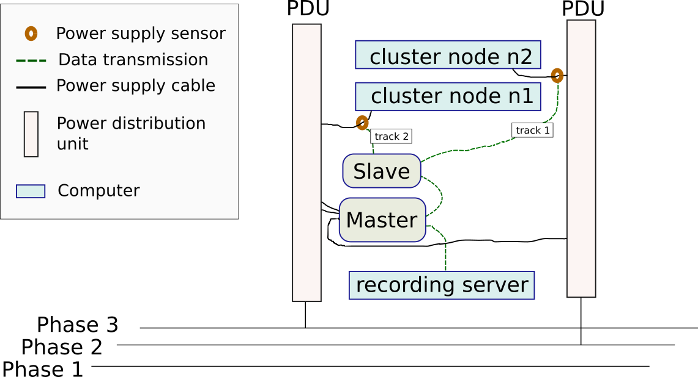
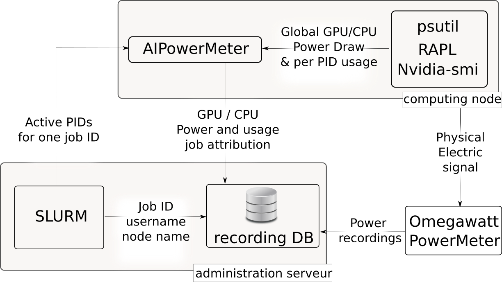

# Lab AI configuration

The solution developed by the company [Omegawat](mv.omegawatt.fr/) makes it possible to replace the power cables of each machine with extensions which include an intensity sensor connected to measurement boxes. The measuring boxes are connected to each other and to a _master_ box which collects all the data, before transmitting it by USB to a server corresponding to one of the Lab-IA machines. It is important that each phase powering a sensor is also used to power the master box, thus providing a reference to precisely measure the voltage. For this reason, the master box has 3 power cables which must be distributed over the phases used by the machines that we wish to measure. Once connected, the device must be configured manually via a web interface by specifying which phase the sensors measure.


<p align="center">

</p>
<em>Illustration of the power measurement of all the machines. The slave box receives the measurements via its sensors which are connected to the power cables. In order to calculate the correct value for a machine, the system uses as a reference the phase on which this machine is via the power supply of the master box. So for example, you must manually indicate in the configuration that channel 1 which measures node n2 is on phase 2.</em>


  ### Data collection from Omegawatt power meters

In practice, the measurements are accessible via a _/dev/ttyUSB0_ port corresponding to the physical USB socket. The _wattmeter-read_ software provided by Oméga Watt allows you to collect the data flow from this port and redirect it to the standard output. This data stream in CSV format will be stored on one of the LabIA machines and recording is carried out continuously on all machines. A correspondence was built between the identifiers of the different Omegawatt sensors and the identifiers of the machines used by the SLURM task manager. In order to reduce the size of the data, the text files are compressed into _zip_ archives. To speed up the reading of the data during analysis, a subsampled version of the measurements is constructed on the fly.


## Data collection

The collection of data makes it possible to know for each task the use of GPUs, CPUs in terms of memory and use of calculation capacities, as well as the electrical power consumed as measured by Nvidia-smi and RAPL.

<p align="center">

</p>
<em>Arrangement of the different software and hardware components with their exchange of information.</em>


    For each _T_ task launched on SLURM, a prolog program starts the AIPowerMeter software and saves the information allowing the data from the different sources to be cross-referenced. An instance of AIPowerMeter is launched on each compute node used by task _T_. The SLURM _scontrol_ command allows you to know which processes belong to the task on the different nodes. AIPowerMeter uses this information to assign CPU and GPU usage to each task and terminate the program when the task is completed. The _delta_ period between each record is a parameter and is set to 2 seconds. In practice this parameter presents several limitations, from RAPL, from nvidia-smi, as well as from the precision of psutil. The system also supports the task sequence mechanism (SLURM job array) by creating measuring each task in the sequence independently.

# Consumption measurement with AIPowerMeter

Record the energy consumption of your cpu and gpu. Check [our documentation](https://greenai-uppa.github.io/AIPowerMeter/) for usage.

This repo is largely inspired from this [experiment Tracker](https://github.com/Breakend/experiment-impact-tracker) 

## Requirements

Running Average Power Limit (RAPL) and its linux interface : powercap 

RAPL is introduced in the Intel processors starting with the Sandy bridge architecture in 2011. 

Your linux os supports RAPL if the following folder is not empty:
```
/sys/class/powercap/intel-rapl/
```

Empty folder? If your cpu is very recent, it is worth to check the most recent linux kernels.

## Installation

```
pip install -r requirements.txt
pip install --force-reinstall --no-cache-dir .
```

You need to authorize the reading of the rapl related files: 
```
sudo chmod -R 755 /sys/class/powercap/intel-rapl/
```


> some examples requires pytorch or tensorflow.
## Usage

See `examples/example_exp_deep_learning.py`.

Essentially, you instantiate an experiment and place the code you want to measure between a start and stop signal.

```
from deep_learning_power_measure.power_measure import experiment, parsers

driver = parsers.JsonParser("output_folder")
exp = experiment.Experiment(driver)

p, q = exp.measure_yourself(period=2)
###################
#  place here the code that you want to profile
################
q.put(experiment.STOP_MESSAGE)

``` 

This will save the recordings as json file in the `output_folder`. You can display them with: 

```
from deep_learning_power_measure.power_measure import experiment, parsers
driver = parsers.JsonParser(output_folder)
exp_result = experiment.ExpResults(driver)
exp_result.print()
``` 

## Lab IA scripts

For each script, run `python script.py --help` for more information on the parameters.

`omegafile_head.py` : simple example to print the first ten lines of a zip_file containing omegawatt recordings 

`omegawatt_1_node.py` : Extract omegawatt recordings for one node and print simple statistics

`compare_raplNvidia_omegawatt.py`  : collect the total power draw from RAPL, Omegawatt, and Nivdia for each node

`plot_rapl_nvidia_omegawatt.py` : Plot the results collected from the json file generated by the script `compare_raplNvidia_omegawatt.py` 


## CRON jobs 

`append_summary_last_jobs.py` : used to collect statistics from last jobs and append them to csv files, one for each user. This script is meant to be used in a cron. 

`cron_script.sh` : main cron script which every day, store the omegawatt logs in zip files and updates csv files containing the statistics for each jobs.
