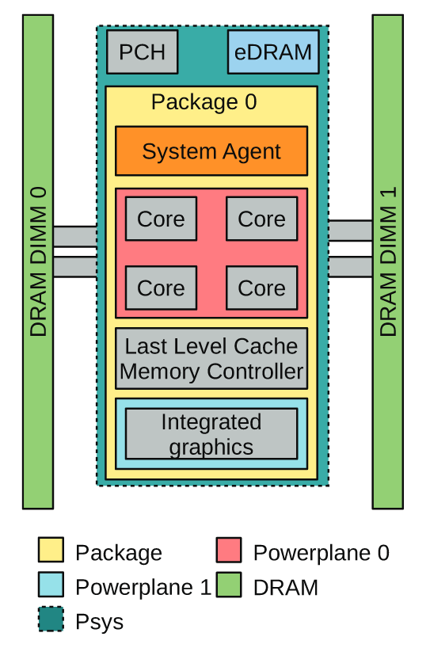

Background on power measure
===========================

General considerations
----------------------
Main sources of energy consumption are the gpu, the cpu and memory.

However, some consumption sources will be missed by your setup, such as optical drives, motherboards, and hard drives.

.. _rapl:

CPU and RAPL
-----------------------------------------------------

The Running Average Power Limit (RAPL) reports the accumulated energy consumption of the cpu, the ram mechanism, and a few other devices (but NOT the cpu). 
It is present since and from Haswell is supported by integrated voltage regulators in addition to power models ( [Hackenberg2015]_ ).

It is divided into different physically meaningfull domains:

   
   RAPL power domains (from [Khan2018]_ )

- Power Plane 0 : the cores alias the CPU
- Power Plane 1 : uncore : memory controller and cache, and an integrated gpu if present (this is not the external nvidia GPU). 
- DRAM : energy consumption of the RAM
- Psys : System on Chip energy consumption

The recording are done for the entire cpu sockets. Thus, to take into account the energy consumed from each program, we adopt the approach implemtented in the `experiment impact tracker <https://github.com/Breakend/experiment-impact-tracker>_` and we multpily the RAPL value by the percentage of cpu and memory used.

The rapl interface writes these values in module specific registers located in `/dev/cpu/*/msr`. These values are updated every 1ms. Although reading from these files is possible, our code relies on the powercap linux tool which updates the energy consumption for the different domains in `/sys/class/powercap/intel-rapl`.

**More readings on RAPL**:

The official documentation is the Intel® 64 and IA-32 Architectures Software Developer Manual, Volume 3: System Programming Guide. But it is not trivial for most data scientists.

Add ref to the finnish guys [Khan2018]_

GPU and nvidia-smi 
---------------------------
description of nvidia-smi
Things are more simple, and unfortunately because we have much less information.
from the man page of `nvidia-smi <https://man.archlinux.org/man/nvidia-utils/nvidia-smi.1.en>`_ : *The last measured power draw for the entire board, in watts. Only available if power management is supported. Please note that for boards without INA sensors, this refers to the power draw for the GPU and not for the entire board.*

Other tools
-----------

CarbonTracker, PAPI, Experiment-Impact-Tracker

Bibliography
------------
.. [Hackenberg2015] An Energy Efficiency Feature Survey of the Intel Haswell Processor.  IEEE International Parallel and Distributed Processing Symposium Workshop. 2015
.. [Khan2018] Khan et al. RAPL in Action: Experiences in Using RAPL for Power Measurements. ACM Transactions on Modeling and Performance Evaluation of Computing Systems. 2018
