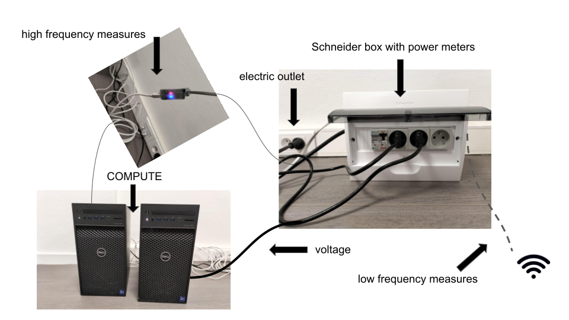

Background on power measure
===========================

This section provide general information on monitoring power on computers.

General considerations
----------------------

The main sources of energy consumption in a computer are the gpu, the cpu and memory. However, other sources are non negligible, among them, the fans, the optical drives, motherboards, and hard drives. Moreover, the consumption will vary according to external factors, such as the temperature, and obviously, the type of programs run by the user. 

.. figure:: computer.png
    
    Different sources of energy consumption. Green boxes are measured by our library (indicative figures)

A generic solution with an easy deployment has to use the inbuilt sensors and available software models, and thus is restricted to what is provided by the constructors. As most of the monitoring tools, we use RAPL for the CPU, and nvidia-smi for the GPU.

Preliminaries
-------------

The unit to measure energy is the Joule, it is the energy transferred to an object when a force of one newton acts on that object in the direction of the force’s motion through a distance of one metre (1 newton-metre or Nm). The watt is the unit to measure power. In other words:

1 watt = 1 Joule per second = The energy required to lift a medium-sized tomato up 1 metre (wikipedia)

.. math::

  1kWh = 3600000\text{ Joules} \approx \text{3 hours of GPU}

.. _rapl:

CPU and RAPL
-----------------------------------------------------

The Running Average Power Limit (RAPL) reports the accumulated energy consumption of the cpu, the ram mechanism, and a few other devices (but NOT the nvidia GPU). 
It is present since the Sandy bridge architecture in 2011 and from Haswell is supported by integrated voltage regulators in addition to power models ( [Hackenberg2015]_ ). There has been considerable study to validate its use for software monitoring ( [Khan2018]_ ).

It is divided into different physically meaningfull domains:

.. figure:: rapl_domain.png
   
   RAPL power domains (from [Khan2018]_ )

- Power Plane 0 : the cores alias the CPU
- Power Plane 1 : uncore : memory controller and cache, and an integrated on chip gpu is present (this is not the external nvidia GPU). 
- DRAM : energy consumption of the RAM
- Psys : System on Chip energy consumption

The rapl interface writes these values in module specific registers located in `/dev/cpu/*/msr`. These values are updated every 1ms. Although reading from these files is possible, our code relies on the powercap linux tool which updates the energy consumption for the different domains in `/sys/class/powercap/intel-rapl`.

**More readings on RAPL**:

The official documentation is the Intel® 64 and IA-32 Architectures Software Developer Manual, Volume 3: System Programming Guide. But it is not trivial for most data scientists.

GPU and nvidia-smi 
---------------------------
Things are more simple with nvidia-smi, unfortunately, the reason for this is because we have much less information.
from the man page of `nvidia-smi <https://man.archlinux.org/man/nvidia-utils/nvidia-smi.1.en>`_ : *The last measured power draw for the entire board, in watts. Only available if power management is supported. Please note that for boards without INA sensors, this refers to the power draw for the GPU and not for the entire board.*

Still, nvidia provides us with the percentage of core memory used by each program for each GPU.

.. _multiple:

Measuring multiple programs
---------------------------

In general, RAPL and nvidia provide us a power measurement for the whole board or entire sockets.  Thus, to take into account the energy consumed from each program, we adopt the approach implemtented in the `experiment impact tracker <https://github.com/Breakend/experiment-impact-tracker>`_ and multiply the RAPL value by the percentage of cpu and memory used. 

However, the energy consumed by programs is not exactly additive. For instance, the amount of Joules spent by two programs running on parallel and in sequence won't be the same. This is due to a fix energy waste, for instance coming from the idle state, and because the relation between the usage of the computer and the energy consumed is not linear. 

In conclusion, we recommend to benchmark a program when it is running alone on the machine.

Schneider Power meters
---------------------------

The previous power measurements are based on specific softwares and hardwares. In order to evaluate the precision and the ground truth, we describe here how to install and use a Schneider set of power meters. The raw material described in this section is a Schneider box (see images below) that measures voltage and active power of (up to) 3 servers. This material is commonly used in data centers in order to monitore several different machines. This box measures at two different frequencies the active power (in Watts) and the voltage as follows:

- at a low frequency regime (up to 1 second), the box saves measurements (at least the past 3 years) that could be downloaded in tsv format by connecting a laptop to the wifi of the box, and using a simple web interface,
- at a high frequency (10 ms), time series are sent via a ethernet cable and a small chip to be readible in a laptop using a given software named **wattmeter_rapid1** that creates log at this high frequency.

It is then possible to use one of these two data sources and compare the ground true to the measurements of RAPL and nvidia-smi.

**Compilation and execution of wattmeter_rapid1**:

.. code-block:: bash

  gcc -std=c11 -o wattmetre-read wattmetre_main.c wattmetre_lib.c -lm
  ./wattmetre-read --tty=/dev/ttyUSB0 --nb=6 > logfile

Related work on power meter libraries
-------------------------------------

There are several tools developed to monitor energy consumption of softwares, and the list is growing everyday, but most are based on RAPL and nvidia-smi. The `Performance Application Programming Interface <https://icl.utk.edu/papi/>`_ has a long history and is a very complete library to measure numerous aspects of a program run. In the specific field of AI and deep learning, serveral repostories such as `CarbonTracker <https://github.com/lfwa/carbontracker/>`_ and `Experiment Impact Tracker <https://github.com/Breakend/experiment-impact-tracker>`_ propose to compute a carbon footprint of your experiment. The development of our own library has started as a fork of this latter project. It's aim is to focus on fine grained energy consumption of deep learning models. Stay tuned with the `Coca4AI <https://greenai-uppa.github.io/Coca4AI/>`_ for a measurement campaign at the scale of a data center. 

