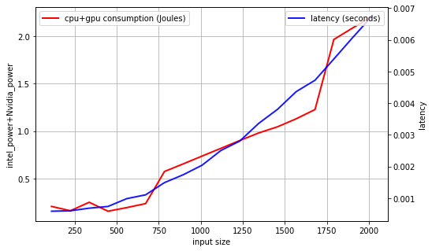
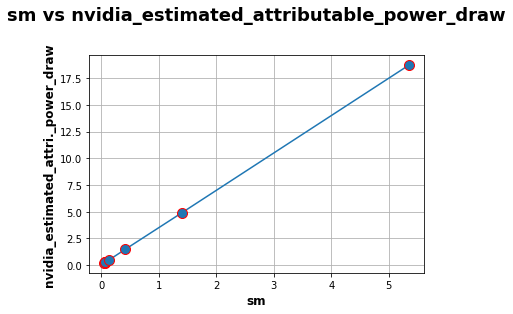

Deep learning benchmark
====================================

This section describes energy measurements for classic deep learning models. For each model, the experiment is as follows: 

To measure the energy consumption of classical deep learning pretrained model at inference, our protocol acts as follows:

- we load a pretrained architecture,

- we select an input size (resolution for Computer Vision, number of tokens for NLP),

- we run x inferences and measure power draws with AIPowerMeter,

- we repeat the experiment 10 times to have more robustness.

Experiments were run with a NVIDIA GeForce RTX 3090 with 24Gb of ram.

Summary : One inference with classic deep learning models
---------------------------------------------------------

+---------------------------+--------------------------+------------------------------+----------------------------------+-------------------------------+
| Model Type                | CNN Object Detection     | CNNs / image Classification  | Transformer Image classification | Transformer Inference on Text |
+---------------------------+--------------------------+------------------------------+----------------------------------+-------------------------------+
| Model Name                |          Yolov5s         |  ResNet                      | VIT B 16                         |         Bert                  |
+===========================+==========================+==============================+==================================+===============================+
| Joules Consumption        | 0.61                     | 0.27                         | 0.94                             |         0.07                  |
+---------------------------+--------------------------+------------------------------+----------------------------------+-------------------------------+
| Batch Size                | 32                       | 128                          | 64                               |        128                    |
+---------------------------+--------------------------+------------------------------+----------------------------------+-------------------------------+
| %GPU SM used              | 91%                      | 60%                          | 92%                              | 76%                           |
+---------------------------+--------------------------+------------------------------+----------------------------------+-------------------------------+
| GPU MEM USED  (GB)        | 11.3                     | 23.2                         | 18.8                             | 1.7                           |
+---------------------------+--------------------------+------------------------------+----------------------------------+-------------------------------+

Experimental protocol
---------------------

For each set of experiments, power measurements and lattencies are written into several power_metrics.json  and latency.csv files: one by tuple (format,x) where format is the chosen input size an integer and x =0, ... 9 following this architecture:

::

    input_format
    ├── run_x          
        ├── power_metrics.json
        └── latency.csv

We then compile  `here <https://github.com/GreenAI-Uppa/AIPowerMeter/blob/main/deep_learning_benchmark/concat_power_measure.py>`_ an estimate of different power draws of one inference and compile the median of the over the 10 runs. For each pretrained model, results are generated into a csv file where each row corresponds to one input size and each column represents the median of one power draw.  

Alexnet study
--------------
As a gentle start, we measure the consumption at inference of a vanilla `Alexnet <https://papers.nips.cc/paper/2012/hash/c399862d3b9d6b76c8436e924a68c45b-Abstract.html>`_ on a GeForce RTX 3090 GPU, and 16 i9 Intel cores CPU.

We first import necessary modules for power draws and torch models downloads.

.. code-block:: python

  import time, os
  import numpy as np
  from deep_learning_power_measure.power_measure import experiment, parsers
  import torchvision.models as models
  import torch

We then load Alexnet model and push it into our GeForce RTX 3090 GPU.

.. code-block:: python

  #load your favorite model
  alexnet = models.alexnet(pretrained=True)
  
  #choose your favorite device
  device = 'cuda' if torch.cuda.is_available() else 'cpu'
  print('Using {} device'.format(device))
  
  #load the model to the device
  alexnet = alexnet.to(device)

We then prepare the experiment protocol described above for a list of 20 input sizes from 112*112 to 2016*2016 resolution sizes. We choose to run an adequate number of inferences for each input size to let AIPowerMeter reports the power draws during around 40 seconds.

.. code-block:: python

  #experiments protocol

  #resolution size list
  input_sizes = [112*(k+1) for k in range(20)]
  #number of experiments
  xps = 10
  

We then start the inferences and measurements for each input size and each experiment.

.. code-block:: python

  #start of the experiments
  for u,input_size in enumerate(input_sizes):
    #number of inferences
    iters = int(40000/(u+1))
    #create a random image
    image_test = torch.rand(1,3,input_size,input_size)
    image_test = image_test.to(device)
    #start of the experiments
    for k in range(xps):
        print('Experience',k+1,'/',xps,'is running')
        latencies = []
        #AIPM
        input_image_size = (1,3,input_size,input_size)
        driver = parsers.JsonParser(os.path.join(os.getcwd(),"input_"+str(input_size)+"/run_"+str(k)))
        exp = experiment.Experiment(driver)
        p, q = exp.measure_yourself(period=2)
        start_xp = time.time()
        for t in range(iters):
            #print(t)
            start_iter = time.time()
            y = alexnet(image_test)
            res = time.time()-start_iter
            #print(t,'latency',res)
            latencies.append(res)
        q.put(experiment.STOP_MESSAGE)
        end_xp = time.time()
        print("power measuring stopped after",end_xp-start_xp,"seconds for experience",k,"/",xps)
        driver = parsers.JsonParser("input_"+str(input_size)+"/run_"+str(k))
        #write latency.csv next to power_metrics.json file
        np.savetxt("input_"+str(input_size)+"/run_"+str(k)+"/latency.csv",np.array(latencies))

We then run `concat_power_measure <https://github.com/GreenAI-Uppa/AIPowerMeter/blob/main/power_metrics_management/concat_power_measure.py>`_ to have the report of our experiments. 

We fist plot the evolution of the GPU and CPU consumption of one inference for each input size. We can note a very strong linear correlation between CPU and GPU consumption, with a factor around 10 (GPU consumption is 10 times bigger than CPU). However, the regression of the consumption with respect to the size of the input is NOT linear: the consumption of one inference seems constant from 112x112 to 672x672 images, then it increases linearly until 1680x1680 images where a second jump occurs for 1792x1792 input size.

We also plot the behaviours of latency and total consumption as a function of the input size. We highlight a smoother evolution for the latency as the input size increases but with a still very high Pearson coefficient (0.98).

As a result, for this particular experiment protocol, we can conclude that *the latency is a reasonable statistic to describe the energy consumption of an Alexnet at inference as a function of the input size*. In the next study, we will propose the same kind of analyses varying the size of the architecture (number of layers, number of filters, size of the filters). 

Resnet study
------------

Following the same steps as for Alexnet study, we have done the measurements with a pretrained Resnet50, using the following parameters:

- we define random colored images with an width/height of 8, 32, 64, 128, 256, 512, 1024, 2048 and 4096,

- the number of inferences is set to 5000 for an input size of 8 up to 2048 and only 1000 for an input size of 4096.

.. image:: resnet_nvidi.png
   :width: 400pt
   :align: center
.. image:: resnet_int_mem.png
   :width: 400pt
   :align: center
.. image:: resnet_laten_sm.png
   :width: 400pt
   :align: center

We also compute the matrix of Spearman correlation :  

.. image:: resnet_spearman.png
   :width: 400pt   

Bert Transformer
-----------------

As a similar study than the previous Alexnet and Resnet one, we measure consumption of a famous NLP transformer: `Bert <https://arxiv.org/abs/1810.04805>`_.

In this case we use torch with a sequence classifier version of Bert, as provided by the `hugging face <https://huggingface.co/transformers/model_doc/bert.html>`_ library.

The process follows previous experiments. The inputs are sequences of **"yes"** tokens of different sizes. 

.. code-block:: python

   # tokenizer call
   tokenizer = BertTokenizer.from_pretrained('bert-base-uncased')
   
   # model creation
   model = BertForSequenceClassification.from_pretrained('bert-base-uncased')
   
   # use gpu to apply model
   model.to(device)

   # Transform data
   sentence = "yes "
   inputs = tokenizer(sentence*n_input, return_tensors="pt") # Tokenization + format input 
   inputs = inputs.to(device)

We chose to vary the input size from 50 to 500 tokens with a 50 token step. Each consumption measure lasts at least 20 seconds in order to have 10 measurements (we set the period parameter to 2).

In the following figure, we can see the evolution of GPU and CPU consumptions in Joules compared to the input size. Interestingly, the GPU consumption shows a linear correlation with the input size. On the other hand, the CPU consumption decreases until a 300 token input size then raises up to 0.26J per iteration. 

On the next figure, we can see the evolution of latency in seconds compared to the input size. The measure is clearly not linear as a gap appears at a size of 300-350 tokens. On this plot, the link between the latency and the energy consumption is not trivial. 

.. image:: latency.png
   :width: 400pt
   :align: center

Deep rewiring 
-----------------

In the article `Training very sparse network with Deep Rewiring <https://arxiv.org/abs/1711.05136>`_ , `G. Bellec <http://guillaume.bellec.eu/>`_ et al. introduce two algorithms allowing to train models with very low connectivy (less than 2%).
The latter are called Deep-R and Soft Deep-R.
The first one induced strong constraints on the network : we have a limited number of connectivity for each iteration of the training.
The second is a relaxed form of Deep-R where the maximal number of connections is not fixed.

For more details about tests and theorical guarantees on the algorithms, we invite you to read the article. 
The implementations are available `here <https://github.com/guillaumeBellec/deep_rewiring>`_. 

At Green AI UPPA, we have measured the consumptions of three available scripts on the problem of classification for MNIST' images.
We worked only on the CPU here.
We used the default parameters (for example 10 epochs and a batch size of 10).

* script_mnist_deep_rewiring.py is the basic implementation of Deep R, 
* script_mnist_deeep_rewiring_with_global_constraint.py, 
* script_mnist_soft_deep_rewiring.py is the implementation of soft Deep-R.

+---------------------------+--------------------------+------------------------------+----------------------------+
| Model                     | CPU consumption (Joules) | Wattmeters measures (Joules) | Training duration(seconds) |
+===========================+==========================+==============================+============================+
| Deep R                    | 19490                    | 28554                        | 249                        |
+---------------------------+--------------------------+------------------------------+----------------------------+
| Deep R Global constraints | 19121                    | 28105                        | 240                        |
+---------------------------+--------------------------+------------------------------+----------------------------+
| Soft Deep R               | 10405                    | 15655                        | 130                        |
+---------------------------+--------------------------+------------------------------+----------------------------+

Pruning 
-----------------

A solution for improving the size and the computation time is called pruning. It consists in selecting some neurons and removing others before, during or after the training of a model.
In this documentation, we decided to implement two solutions called SNIP (by `Namhoon Lee & al. <https://arxiv.org/absS/1810.02340>`_) and Force (by `Pau de Jorge & al. <https://arxiv.org/absS/2006.09081>`_) who both prune a model once at initialization and achieve a deletion of 95 to 99.5% parameters without losing much precision. 

SNIP 
-----------------
For our experiments, we used an `unofficial implementation <https://github.com/mil-ad/snip>`_ using `PyTorch <https://pytorch.org/>`_ because the code proposed by the author was implemented in an old tensorflow version, which doesn't allow the use of a GPU. We decided to test two architectures and each one with a specific dataset : respectively LeNet5-Caffe with MNIST dataset and vgg-D with CIFAR-10.
To make sure our experiment is not influenced by the random initialization of parameters, we run three times the whole training process with a different seed. At the end, we plot the precision, the computation time and of course the total energy consumption of the GPU and the machine thanks to the use of AIPowerMeter and a wattmeter.

.. list-table:: Results of our experiments with SNIP
   :widths: 30 30 40 30 30 30 30
   :header-rows: 1

   * - Architecture
     - Dataset
     - Pruning ?
     - Parameters
     - Time (hh:mm:ss)
     - Max precision (%)
     - Total consumption (Wh)
   * - LeNet5-Caffe
     - MNIST
     - no
     - 430,500
     - 30:18
     - 99.42
     - 145.5
   * - 
     - 
     - yes (98%)
     - 8,610
     - 28:26
     - 99.15
     - 145.28
   * - vgg-D
     - CIFAR-10
     - no
     - 15,239,872
     - 1:40:18
     - 93.55
     - 785
   * -
     -
     - yes (95%)
     - 761,994
     - 1:39:01
     - 93.13
     - 771

We can observe the same results in precision as the paper between the original architecture and the pruned one, but our experiment cannot conclude on a significative improvement in computation time nor an economy in energy.
To understand those results, we argue that the implementation only put the value of every pruned neuron at zero, and then having a high sparsity.

Force 
-----------------
Force can be seen as an iterative SNIP as described by the authors of the algorithm. In this section,
the results of the model in term of energy consumption is described. AIPowerMeter can be used like in the previous examples
to infer the energy consumption. In this experiment, a wattmeter was also used.

Force was launched on CIFAR-10 with a VGG implementation. Like in the paper, the accuracy remains very high with high pruning levels.
Pruning is then a great solution to reduce the size of a neural network. However, the same conclusions appear. In term of energy
consumption, there is no clear differences between the pruned model and the full model. We infer that the reason for that is
that the optimisation algorithm is not implemented to deal with sparse matrixes. Thus, we do not obtain any gain in time complexity
and in energy consumption.

.. list-table:: Results of our experiments with Force
   :widths: 50 50 50
   :header-rows: 1

   * - Pruning level
     - Accuracy
     - Inference time

   * - 0
     - 0.93
     - 8.33e-3

   * - 0.9
     - 0.92
     - 8.37e-3
