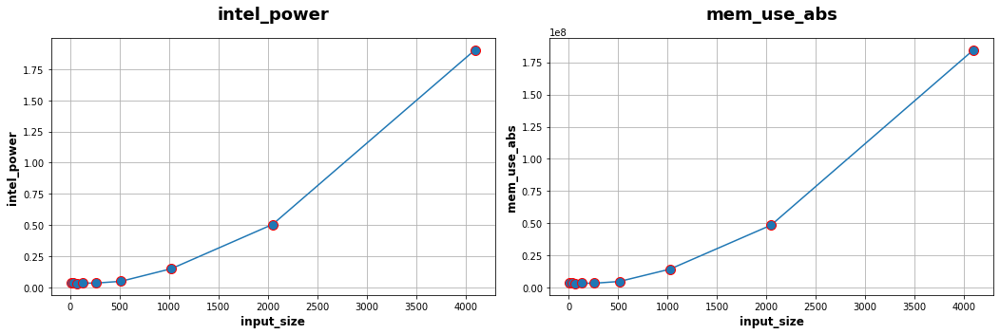

Deep learning benchmark
====================================

Experimental protocol
---------------------

We've started to run experiments to measure the energy consumption of classical deep learning pretrained model at inference. Our protocol acts as follows:

- we load a pretrained architecture,

- we select an input size (resolution for Computer Vision, number of tokens for NLP),

- we run x inferences and measure power draws with AIPowerMeter,

- we repeat the experiment 10 times to have more robustness.

For each set of experiments, power measurements and lattencies are written into several power_metrics.json  and latency.csv files: one by tuple (format,x) where format is the chosen input size an integer and x =0, ... 9 following this architecture:

::

    input_format
    ├── run_x          
        ├── power_metrics.json
        └── latency.csv

We then compile  `here <https://github.com/GreenAI-Uppa/AIPowerMeter/blob/main/power_metrics_management/concat_power_measure.py>`_ an estimate of different power draws of one inference and compile the median of the over the 10 runs. For each pretrained model, results are generated into a csv file where each row corresponds to one input size and each column represents the median of one power draw.  

Alexnet study
--------------
As a gentle start, we measure the consumption at inference of a vanilla `Alexnet <https://papers.nips.cc/paper/2012/hash/c399862d3b9d6b76c8436e924a68c45b-Abstract.html>`_ on a GeForce RTX 3090 GPU, and 16 i9 Intel cores CPU.

We first import necessary modules for power draws and torch models downloads.

.. code-block:: python

  import time, os
  import numpy as np
  from deep_learning_power_measure.power_measure import experiment, parsers
  import torchvision.models as models
  import torch

We then load Alexnet model and push it into our GeForce RTX 3090 GPU.

.. code-block:: python

  #load your favorite model
  alexnet = models.alexnet(pretrained=True)
  
  #choose your favorite device
  device = 'cuda' if torch.cuda.is_available() else 'cpu'
  print('Using {} device'.format(device))
  
  #load the model to the device
  alexnet = alexnet.to(device)

We then prepare the experiment protocol described above for a random 224X244 image. We choose to run 4000 inferences to let AIPowerMeter reports the power draws during 40 seconds.

.. code-block:: python

  #experiments protocol
  iters = 4000#number of inferences
  xps = 10#number of experiments to reach robustness
  
  #choose a resolution size
  input_size = 224
  
  #create a random image
  image_test = torch.rand(1,3,input_size,input_size)
  #for GPU use
  image_test = image_test.to(device)

We then start the inferences and measurements.

.. code-block:: python

  #start of the experiments
  for k in range(xps):
  	print('Experience',k,'/',xps,'is running')
  	latencies = []
  	#AIPM
  	input_image_size = (1,3,input_size,input_size)
  	driver = parsers.JsonParser(os.path.join(os.getcwd(),"input_"+str(input_size)+"/run_"+str(k)))
	exp = experiment.Experiment(driver,model=alexnet,input_size=input_image_size)
	p, q = exp.measure_yourself(period=2)
	start_xp = time.time()
	for t in range(iters):
		start_iter = time.time()
		y = alexnet(image_test)
		res = time.time()-start_iter
		#print(t,'latency',res)
		latencies.append(res)
	q.put(experiment.STOP_MESSAGE)
	end_xp = time.time()
	print("power measuring stopped after",end_xp-start_xp,"seconds for experience",k,"/",xps)
	driver = parsers.JsonParser("input_"+str(input_size)+"/run_"+str(k))
	#write latency.csv next to power_metrics.json file
	np.savetxt("input_"+str(input_size)+"/run_"+str(k)+"/latency.csv",np.array(latencies))

Resnet study
------------

Following the same steps as for Alexnet study, we have done the measurements with a pretrained Resnet50, using the following parameters:

- we define random colored images with an width/height of 8, 32, 64, 128, 256, 512, 1024, 2048 and 4096,

- the number of inferences is set to 5000 for an input size of 8 up to 2048 and only 1000 for an input size of 4096.

.. image:: resnet_laten_sm.png
   :width: 400pt
   :align: center
.. image:: resnet_sm_nvi.png
   :width: 300pt
   :align: center

We also compute the matrix of Spearman correlation :  

.. image:: resnet_spearman.png
   :width: 400pt   

Bert Transformers
-----------------

As a similar study than the previous Alexnet and Resnet one, we measure consumption of a famous NLP transformers: `Bert <https://arxiv.org/abs/1810.04805>`_.

In this case we use torch with a sequence classifier version of Bert. Provided by the `transformers <https://huggingface.co/transformers/model_doc/bert.html>`_ library.

The process is quite similar then before. We have a main object of 10 runs of multiplte measures. We just change the input size. Hence, we chose to set **"yes "** as main sentence. Next we juste have to repeat this "sentence" by the wanted input size.

.. code-block:: python

   # tokenizer call
   tokenizer = BertTokenizer.from_pretrained('bert-base-uncased')
   
   # model creation
   model = BertForSequenceClassification.from_pretrained('bert-base-uncased')
   
   # use gpu to apply model
   model.to(device)

   # Transform data
   sentence = "yes "
   inputs = tokenizer(sentence*n_input, return_tensors="pt") # Tokenization + format input 
   inputs = inputs.to(device)

First outputs:

We chose to vary the input size from 50 to 500 token with a 50 tokens step (Bert is limited to 512 tokens). Each measure consumption last at least 20 seconds in order to have 10 metrics in our output.

Here we can see the evolution of GPU and CPU consumption in Joule compared to the input size. The output is pretty interesting because GPU consumption seems to be linear compared to the input size. Whereas the CPU consumption decrease until a 300 tokens input size then shoot up to 0.26J per iteration. 

.. image:: GPU_CPU.png
   :width: 400pt
   :align: center

On the next figure we can see the evolution of latency in seconds compared to the input size. The measure is clearly not linear. A gap appears at 300-350 tokens. This observation let us think that a link exists beetween CPU consumption and latency. 

.. image:: latency.png
   :width: 400pt
   :align: center

These outputs are interesting because iteration has been realised on GPU. We shouldn't be able to see a link between CPU consumption and latency. 
