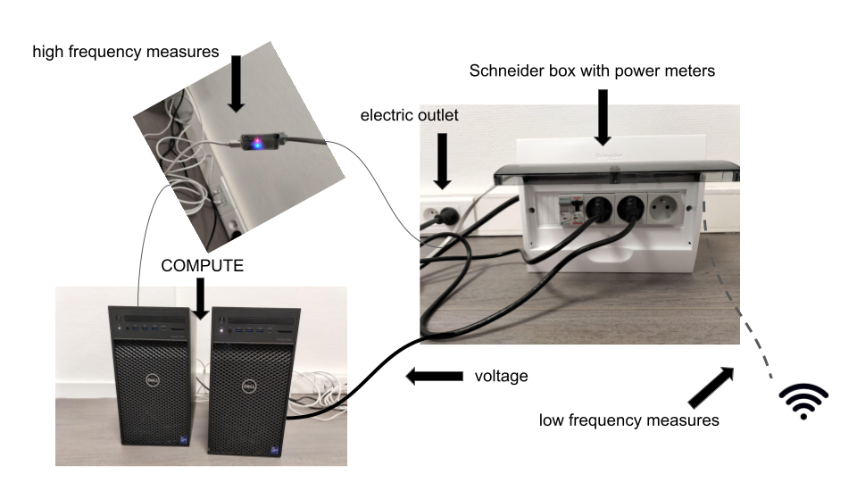
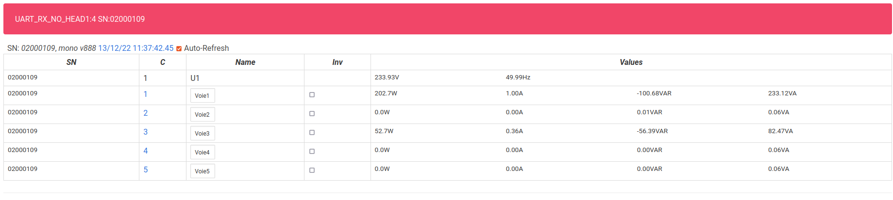
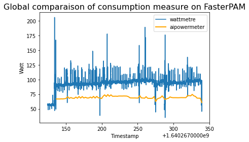
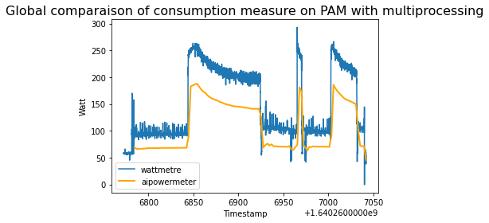
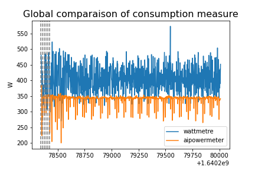
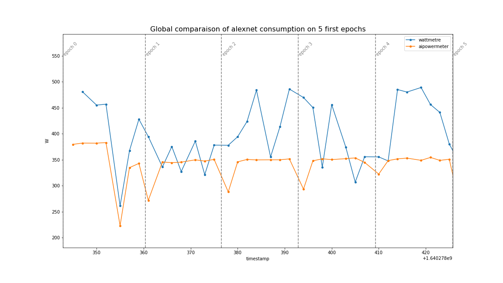

Machine and Deep Learning Benchmarks with wattmeters
================================================================

OmegaWatt Power meters
---------------------------

The AIPM measurements which rely on RAPL and nvidia-smi only measure a subset of the computer components (GPU, CPU) and ignore others (fans, hard drive). The power consumption of the whole computer might increase up to 30\% with respect to these measures. We describe here how to install and use an `OmegaWatt <http://omegawatt.fr>`_ set of power meters to evaluate this global consumption. The raw material described in this section is a box (see images below) that measures voltage and active power of (up to) 3 servers. This material is commonly used in data centers in order to monitor several different machines. This box measures at two different frequencies the active power (in Watts) and the voltage as follows:

- at a low frequency regime (up to 1 second), the box saves measurements (at least the past 3 years) that could be downloaded in tsv format by connecting a laptop to the wifi of the box, and using a simple web interface,
- at a high frequency (10 ms), time series are sent via a ethernet cable and a small chip to be readable in a laptop using a given software named **wattmeter_rapid1** that creates a log at this high frequency.

Tracking at Low Frequency from wifi
----------------------------------------------

The OmegaWatt box has its own wifi and you can connect to acquire the power readings from the different devices which are connected to this box. The recordings are updated in live on a web page.

For more details, you can refer to the french OmegaWatt documentation :download:`pdf <../MV2_guide4.pdf>`

Track with High Frequency measures
------------------------------------------------------

**Compilation and execution of wattmeter_rapid1**:

To compile the wattmeter from OmegaWatt, you need to use the following command :

.. code-block:: console

  $ gcc -std=c11 -o wattmetre-read wattmetre_main.c wattmetre_lib.c -lm

Once you get the executable file "wattmetre-read", you can execute it whenever you want to track your consumption :

.. code-block:: console
   
  $ ./wattmetre-read --tty=/dev/ttyUSB0 --nb=6

And this should provides a similar output (you can keep it in a logfile using the linux redirection symbol **>**) :

.. code-block:: console

  #timestamp,#frame_is_ok,#U1,#U2,#U3,#current1,#activepow1,...
  1671527189.294241015,false,,,,,,,,,,,,,,,
  1671527189.304214184,false,,,,,,,,,,,,,,,
  1671527189.314471465,true,232.3,0.0,0.0,0.1,20.9,...
  1671527189.324185946,true,233.0,0.0,0.0,0.1,21.0,...
  1671527189.334488177,true,233.0,0.0,0.0,0.1,21.0,...

Definition of each column :

:#timestamp: (float) time of the current frame
:#frame_is_ok: (boolean) do we have data from the current frame
:#U1: (float) tension in Volt for phase 1
:#U2: (float) tension in Volt for phase 2
:#U3: (float) tension in Volt for phase 3
:#currentn: (float) current of the machine connected to socket **n** in Ampere
:#activepown: (float) active power of the machine connected to socket **n** in Watt

*Remark:* if you have trouble to access to */dev/ttyUSB0*, we should use the following command : 

.. code-block:: console

   $ sudo chmod 666 /dev/ttyUSB0

To record your experiment, one quick and dirty way is to call these commands from your python code as explained in the following. 

**From the machine where the USB is connected**:

.. code-block:: python
  
  p, q = exp.measure_yourself(period=2) # measure every 2 seconds
  ###################
  #  place here the code that you want to profile
  ################
  q.put(experiment.STOP_MESSAGE)   
   os.system("/path/to/wattmetre-read --tty=/dev/ttyUSB0 --nb=6 > logfile 2>&1 & echo $! > wm_pid")

And finally, at the end of your training you have to kill the process otherwise it will track forever the active power in background.

.. code-block:: python

   os.system("kill -10 `cat wm_pid`")

**From another machine**:

This time we need to add an ssh connection to start the tracking, and copy the result afterwards.
Please, make sure to copy your ssh public key to the remote machine allowing the script to connect to the destination without the need of the password.
To copy your public key, you just need to run the two following commands (or only the second if you have already generated a RSA key)

.. code-block:: console

   $ ssh-keygen -t rsa -b 2048
   $ ssh-copy-id -i ~/.ssh/id_rsa.pub username@example.org

Instead of `os`, we used the `subprocess` package (as earlier, don't forget to import subprocess), but it's the same principle :

.. code-block:: python

   subprocess.call(['ssh', 'username@example.org', '/path/to/wattmetre-read', '--tty=/dev/ttyUSB0', '--nb=6', '>', logfile, '2>&1', '&', 'echo', '$!', '>', 'wm_pid'])

You need also to add a `scp` command to copy the logfile afterwards to your local machine.

.. code-block:: python

   subprocess.call(['ssh', 'username@example.org', 'kill', '-10', '`cat', 'wm_pid`'])
   subprocess.call(['scp', 'username@example.org:/path/to/logfile', '/local/path/'])

Benchmarks
---------------------------

First tests have been realized to compare measurements done with AIPowerMeter and OmegaWatt Power meters.
The measures with the Power Meter are stored in a logfile and looks like :

.. image:: gcc_watt.png
   :width: 400pt
   :align: center

**Benchmark at Prof En Poche** 
 
With `Prof En Poche <https://profenpoche.com/>`_, we are jointly working on adaptive learning and especially on clustering of student profils.
We have compared the consumption of two clustering methods, the PAM KMedoids algorithm in multiprocessing `with PyClustering library <https://pyclustering.github.io/docs/0.10.1/html/index.html>`_ and an improved version FasterPAM implemented `here <https://github.com/kno10/python-kmedoids>`_ . 
We have also measured the consumption with AIPowerMeter. 

At the end, we observe the following compsumptions :

For FasterPAM : 19,181.3 J (Joules) with the wattmeter and 14,107.4 J with AIPowerMeter, during 200 seconds,

For PAM with multiprocessing : 39,061.5 J with the wattmeter and 28,027.0 with AIPowerMeter, during 250 seconds.    

**Benchmark on image classification with AlexNet**

In order to compare the AIpowermeter package and the real consumption from a wattmeter. We are interested in the power consumed during the training of an alexNET on a CIFAR10 data set.
We use classical gradient descent with a learning rate of 0.001 as optimizer and the cross entropy as loss.

We can see above the overview of the power consumed by the machine during the training of an alexnet. Noticed that we have both a larger variance and about 250 times more data measured by the wattmeter than by AIpowermeter.
Let's zoom in on the hatched part which corresponds to the epoch 5 to 11.

In order to "correct" the excessive variance of the wattmeter, we have represented in dark blue the moving average, with a step of 200, calculated on our data.
The observation of these 5 epochs allows us to observe a clear descent of the consumption between some epoch. The  wattmeter is more precise and shows us that the consumption is not constant during an epoch.

A complete jupyter-notebook is available `here <https://github.com/GreenAI-Uppa/AIPowerMeter/blob/main/docsrc/experiments/measure.ipynb>`_.
