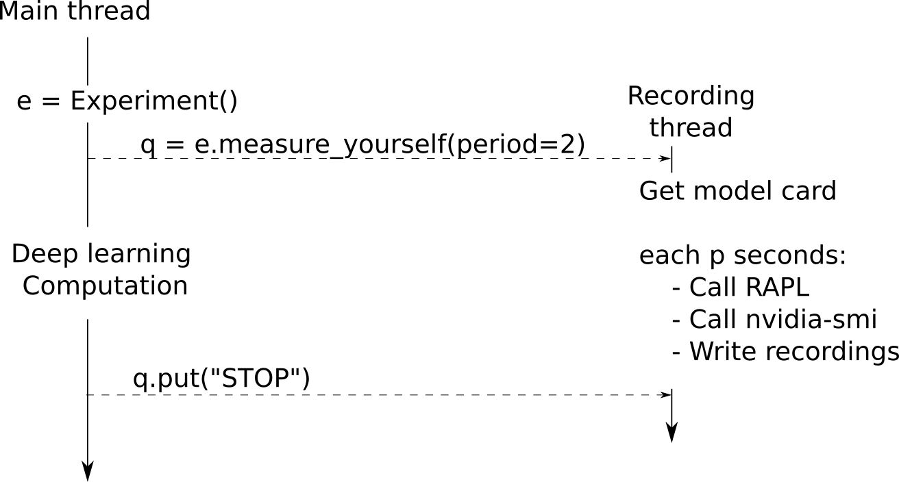

Dev Documentation
===================

Brief description of some key functions

Experiment module
-----------------
.. automodule:: deep_learning_power_measure.power_measure.experiment

In practice, a thread is launched to record the energy of your program.

   Interaction between the experiment and the recording threads

If you want to record also the time, accuracy and other valuable metrics, the simplest way is to do it in the main thread and then, to interpolate with the timestamps of the energy recordings if an alignement is needed.

.. autofunction:: deep_learning_power_measure.power_measure.experiment.Experiment

rapl_power module
---------------------

.. automodule:: deep_learning_power_measure.power_measure.rapl_power

.. autofunction:: deep_learning_power_measure.power_measure.rapl_power.get_mem_uses

.. autofunction:: deep_learning_power_measure.power_measure.rapl_power.get_cpu_uses

.. autofunction:: deep_learning_power_measure.power_measure.rapl_power.get_power

gpu_power module
-----------------

.. automodule:: deep_learning_power_measure.power_measure.gpu_power

.. autofunction:: deep_learning_power_measure.power_measure.gpu_power.get_nvidia_gpu_power
